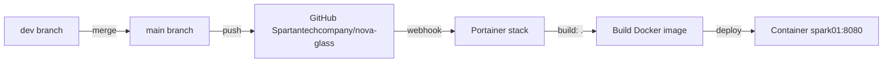

**Origen → Destino**
- [ ] dev → main (merge)
- [ ] QA → prod (Portainer stack)
- [ ] hotfix → prod

**Flujo GitOps (Portainer)**

**Pre-requisitos**
- [ ] Pruebas manuales en dev (8081) y QA (8083)
- [ ] Nodos reportando datos (spark01 + spark02)
- [ ] NOVA Insights funcionando (LLM reachable)
- [ ] Dispositivos NOC verdes en dashboard
- [ ] `docker-compose.yml` con `build: .` y `pull_policy: build`

**Pasos GitOps**
- [ ] Merge dev → main
- [ ] Push a `refs/heads/main`
- [ ] Portainer detecta cambio (o webhook manual)
- [ ] Portainer build + deploy automático
- [ ] Verificar healthcheck en `spark01:8080/api/health`
- [ ] Verificar recolección de datos

**Rollback plan**
- [ ] En Portainer: Stack → Update → cambiar `refs/heads/main` a commit anterior
- [ ] O usar `git revert` + push para restaurar versión anterior
